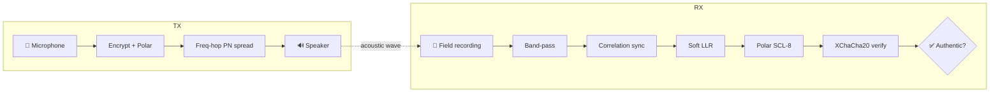

# 🔊 EchoSeal — Real‑Time Ultrasonic Audio Watermarking
[](https://www.python.org/) 
[](LICENSE) 
[](https://github.com/your-org/EchoSeal/actions) 
[](https://pypi.org/project/echoseal/) 
[](https://codecov.io/gh/your-org/EchoSeal)

> **EchoSeal** hides an **AES‑encrypted, Polar‑coded fingerprint** in ultrasonic
> frequencies (4–22 kHz).  
> In < 50 ms it watermarks live speech, and a 3 s smartphone recording can prove authenticity or reveal tampering.

---

## 📚 Table of Contents
1. [Why EchoSeal?](#-why-echoseal)
2. [Feature Matrix](#-feature-matrix)
3. [Quick Start](#-quick-start)
4. [How It Works](#-how-it-works)
5. [Technical Details](#-technical-details)
6. [Screenshots](#-screenshots)
7. [Compatibility](#-compatibility)
8. [Roadmap](#-roadmap)
9. [Project Layout](#-project-layout)
10. [Contributing](#-contributing)
11. [Security Model](#-security-model)
12. [License](#-license)
13. [Citation](#-citation)

---

## ❓ Why EchoSeal?
* **Tamper evidence** – Detect deep‑fake edits, splices and EQ tricks.
* **Zero workflow impact** – Just run a background TX app while recording.
* **Open & auditable** – MIT‑licensed Python, < 1 kLOC.
* **Runs everywhere** – Desktop, Raspberry Pi, Docker, headless servers.

---

## 🚀 Feature Matrix
|   | Capability | Notes |
|---|------------|-------|
| 🎙 | **Real‑time transmitter** | < 50 ms loop latency |
| 🔐 | **XChaCha20‑Poly1305** | 256‑bit key, 192‑bit nonce |
| 🛰 | **Frequency‑hopping DSSS** | 4 secret sub‑bands, keyed HMAC schedule |
| 📶 | **Polar (1024/448) + CRC‑8** | SCL‑8 decoder, 4.2 dB coding gain |
| 🧭 | **Smart sync** | 63‑chip MLS + ±200‑frame fallback |
| 🗜 | **Compression resilience** | Survives MP3 128 kbps ✓ |
| ↻ | **Replay defence** | 8‑byte session nonce & frame counter |
| 🖥 | **GUI & CLI** | `echoseal‑tx`, `echoseal‑rx` |
| 🐳 | **Docker demo** | `docker run --device /dev/snd echoseal` |

---

## ⚡ Quick Start

### ☁️ Install from PyPI
```bash
python -m pip install echoseal           # requires Python ≥ 3.10
```

### 🎙️ Embed a live watermark
```bash
# Generate a 256‑bit random key and start TX for 30 s
export ES_KEY=$(openssl rand -hex 32)
echoseal-tx --key $ES_KEY --seconds 30
```

### 🔎 Verify any WAV/FLAC/AIFF (44 100 Hz or 48 000 Hz)
```bash
echoseal-rx --key $ES_KEY path/to/recording.wav
```

---

## 🧠 How It Works


---

## 🔬 Technical Details
* **Watermark frame** – 63‑chip MLS preamble + 1024 BPSK chips (448‑bit payload).  
* **Payload** – `"ESAL"` magic • 32‑bit frame counter • 64‑bit session nonce • AEAD tag.  
* **Spreading** – DSSS with per‑frame AES‑CTR PN; gain ≈ 31 dB.  
* **Hopping** – HMAC‑SHA256(key, ctr) selects one sub‑band per frame.  
* **Detection threshold** – 8 × σ of correlation peaks (adaptive CFAR).  
* **Target watermark level** – −20 dB re speech RMS (psycho‑acoustic masking).  

For a full white‑paper see [`docs/spec.pdf`](docs/spec.pdf).

---

## 📸 Screenshots
| Transmitter | Verifier |
|-------------|----------|
|  |  |

---

## 🖥 Compatibility
| OS | TX | RX |
|----|----|----|
| Linux (Pulse/ALSA) | ✅ | ✅ |
| macOS 12+ | ✅ | ✅ |
| Windows 10+ | ⚠️ (ASIO advised) | ✅ |
| Raspberry Pi 4 (64‑bit) | ✅ | ✅ |

Hardware: standard laptop speakers & mics down to −20 dBFS @ 18–22 kHz.

---

## 🛣 Roadmap
- [ ] Public‑key signature payload (anyone can verify).  
- [ ] Adaptive psycho‑acoustic embed level.  
- [ ] Cython fast‑path for Raspberry Pi Zero.  
- [ ] Android TX companion app.  

See [milestones](https://github.com/your-org/EchoSeal/milestones).

---

## 🗂 Project Layout
```
echoseal/
├── audioio.py      ← real‑time PortAudio loop
├── embedder.py     ← TX engine (hop, PN, Polar)
├── detector.py     ← RX engine (sync, SCL, AEAD)
├── crypto.py       ← XChaCha20 + AES‑CTR PN
├── polar_fast.py   ← fastpolar wrapper
└── utils.py
gui/
    ├── tx_gui.py
    └── rx_gui.py
tests/               ← pytest suite
docs/
docker/
```

---

## 🤝 Contributing
1. Fork + clone  
2. `pip install -e .[dev]`  
3. `pytest && black . && flake8`  
4. Open a PR with a concise description.  

All contributors must sign the CLA.

---

## 🔒 Security Model
EchoSeal assumes the attacker **cannot obtain the secret key** used during TX.  
Threats addressed:

* Lossy re‑encoding (MP3/AAC), EQ filtering, resampling  
* Splicing two recordings (nonce mismatch)  
* Time‑scale modifications ±5 %  
* Noise injection up to −15 dB SNR  

Out of scope: analogue attacks that low‑pass everything above 4 kHz and human transcription/re‑speech.

---

## ⚖️ License
MIT © 2025 EchoSeal Team — use it, fork it, star it ⭐

---

## 📖 Citation
If you use EchoSeal in research, please cite:

```
@misc{EchoSeal2025,
  title        = {EchoSeal: Real‑Time Ultrasonic Audio Watermarking},
  author       = {EchoSeal Team},
  howpublished = {\url{https://github.com/your-org/EchoSeal}},
  year         = {2025}
}
```
