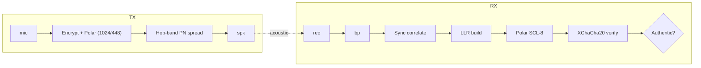

# 🔊 EchoSeal — Real‑Time Ultrasonic Audio Watermarking

[](https://www.python.org/)
[](LICENSE)
[](https://github.com/your-org/EchoSeal/actions)
[](https://pypi.org/project/echoseal/)

> 🔐 **EchoSeal** hides an AES‑encrypted, Polar‑coded fingerprint in the 18‑22 kHz
> band of live speech, then proves authenticity from any 3 s smartphone recording.

---

## 🎯 Features (2025)

| 🔎 | Capability |
|----|------------|
| 🎙 **Zero‑latency TX** | ≤ 50 ms loopback, laptop mic + speaker |
| 🔐 **XChaCha20‑Poly1305** | 256‑bit key, per‑frame nonce, session anti‑replay |
| 📶 **Polar (1024 / 448) + CRC‑8, SCL‑8** | Survives MP3, AAC, re‑recording |
| 🛰 **Frequency‑Hopping SS** | 4 secret sub‑bands → LPF attack futile |
| 🧭 **Sync + Δ‑window search** | Robust to ±5 % time‑scale & dropped frames |
| 🧪 **Tamper verdict** | Flags splice / filter / missing watermark |
| 🖥 **GUI & CLI** | Tkinter dashboards + scripts (`echoseal-tx`, `echoseal-rx`) |
| 🐳 **Docker demo** | `docker run --device=/dev/snd echoseal` |

---

## 📸 Screenshots

<p float="left">
  
  
</p>

---

## 🚀 Quick‑Start

### 1 · Install

```bash
pip install echoseal           # or: pip install git+https://github.com/your-org/EchoSeal
```

### 2 · Live watermark

```bash
echoseal-tx --key $(openssl rand -hex 32)
```

### 3 · Verify a recording (44.1 k / 48 k accepted)

```bash
echoseal-rx --key <same‑key> path/to/recording.wav
```

---

## 🧠 How it works



---

## 🧪 Run tests

```bash
pip install -e .[dev]
pytest -q         # 6 tests
```

---

## 📂  Project Layout

```
echoseal/
├── audioio.py      · real‑time PortAudio loop
├── embedder.py     · TX engine (hop, PN, Polar)
├── detector.py     · RX engine (sync, SCL, AEAD)
├── crypto.py       · XChaCha20 + PN stream
├── polar_fast.py   · fastpolar wrapper
└── utils.py
gui/
└── tx_gui.py · rx_gui.py
tests/
```

---

## ⚖️ License

MIT © EchoSeal Team 2025
